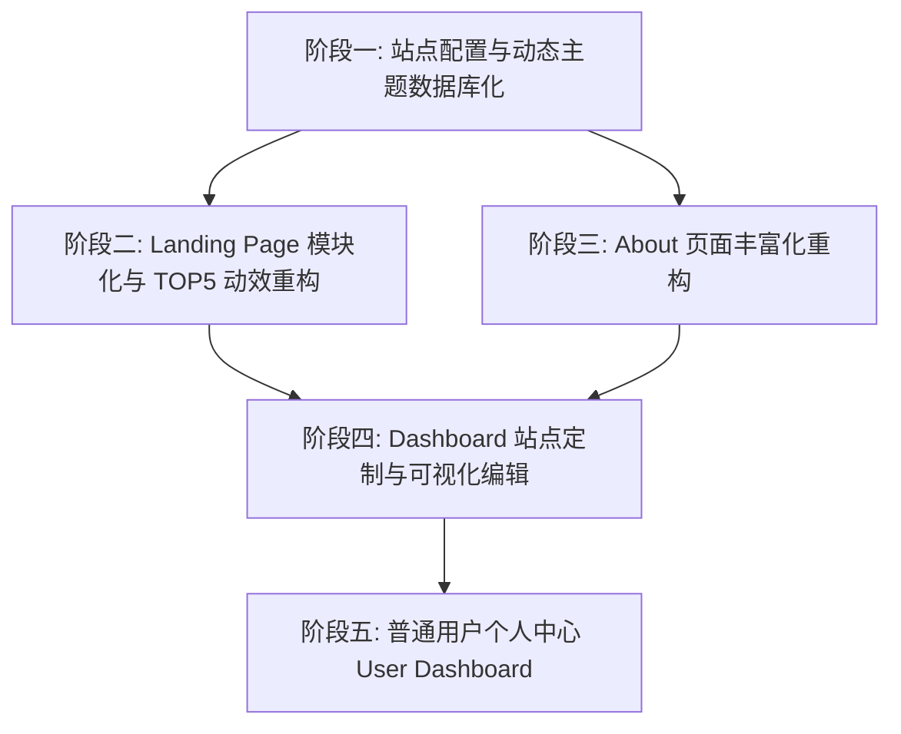

# 下一阶段开发计划（Stage 3 规划：动态主题、页面自定义与用户中心）

> 依据 `documents/thoughts.md` 中的最新需求，结合 Stage 2（统一 Post 架构、Drizzle ORM 迁移、管理员 Dashboard、社交图标自建库）完成后的系统现状制定。  
> 制定日期：2026-09-07

---

## 📊 一、 背景与前置基础分析

### 1. 当前已完成基础（Stage 2 交付成果）
- **数据层**：已彻底完成 **Drizzle ORM + PostgreSQL (Neon)** 迁移，Prisma 已完全移除。
- **内容架构**：文章（Post）体系已完全统一收拢，支持多标签、Markdown 解析、封面与状态管理（PUBLISHED / DRAFT / ARCHIVED 等）。
- **认证与后台**：基于 **Better-Auth** 构建了完整的 Session 与 Role 权限控制（`ADMIN`/`EDITOR`/`USER`）；实现了管理员 CLI 重置密码工具、Dashboard 文章管理看板（`/dashboard/posts`）、可视化同步导入中心（`/dashboard/sync`）以及用户管理与手动重置（`/dashboard/users`）。
- **组件与类型**：零额外依赖自建了社群媒体 SVG 图标系统；补齐了 Next.js 全局/局部 `error.tsx` 错误边界与移动端响应式断点。

### 2. 本阶段核心演进目标（Stage 3）
根据 `thoughts.md`，下一阶段的核心任务聚焦于：**数据库驱动的动态页面配置/主题定制**、**Landing Page 动效重构**、**About 页面现代化重构** 以及 **普通用户个人中心（User Portal）与互动增强**。

---

## 🗺️ 二、 下一阶段核心任务拆解

---

### 🎨 阶段一：站点配置与动态主题数据库化（Dynamic Settings & Theming）
**目标**：将全站的主题配色（CSS 变量/shadcn `globals.css` 格式）、页面开关与模块化布局配置持久化到数据库，支持热更新。

1. **Schema 扩展与数据建模 (`src/db/schema/site-profile.ts`)**
   - 扩展 `siteProfile` 表或拆分出 `siteSettings`：
     - `themeConfig`: JSON 格式，存储自定义主题变量（Light/Dark 模式下的 `--background`, `--primary`, `--radius`, `--card` 等），兼容 shadcn / Tailwind 4 配置。
     - `landingPageConfig`:
       - `enabled`: boolean（Landing Page 落地页开关，若关闭则可直达文章列表或关于页）。
       - `showTopHottest`: boolean（是否展示 TOP 5 热门文章轮播/翻页）。
       - `showSlogans`: boolean（口号视差区域开关）。
       - `showPinnedPosts`: boolean（置顶文章开关）。
       - `showLatestPosts`: boolean（最新文章开关）。
       - `pinnedPostIds`: string[]（置顶文章 ID 列表）。
     - `aboutPageConfig`: 存储结构化经历、技能、教育、社交与项目亮点数据。
2. **全局动态主题注入机制**
   - 在 `RootLayout` 或专用 ThemeProvider 中读取数据库的 `themeConfig`，动态注入 CSS 变量 style 标签，实现免重新编译的换肤能力。

---

### 🚀 阶段二：Landing Page 模块化与 TOP 5 翻页动效
**目标**：提升首页视觉冲击力与模块掌控度，重构动效体验。

1. **Top 5 Hottest 文章翻页动效**
   - 引入卡片翻页/滑动动效（如基于 `motion` 的 Stack Cards / 3D Flip 交互），展示全站热度（评论数/浏览量）最高的 5 篇文章。
2. **首页分区块组合（根据配置条件渲染）**
   - **Header / Slogan 视差区**：继承并优化现有平滑滚动体验。
   - **TOP 5 热门文章轮播/翻页区**。
   - **置顶推荐文章区（Pinned Posts）**。
   - **最新发布文章瀑布流/网格区（Latest Posts）**。
3. **落地页开关控制**
   - 若后台配置 `landingPageConfig.enabled === false`，访问 `/` 自动平滑重定向或直接渲染精简内容流。

---

### 👨‍💻 阶段三：About 页面丰富化重构（参考 mafifi.dev）
**目标**：打造极具个人品牌与工程素养的现代化“关于”页面。

1. **视觉与内容板块升级**
   - **Hero 个人导语**：大字号标语、自我定位与在线状态。
   - **时间线（Work & Career Timeline）**：工作经历、教育背景与重大成就（时间、职位、公司、亮点）。
   - **技能栈（Tech Stack & Tooling）**：按分类（Frontend, Backend, DevOps, Design）展示熟练度与常用工具。
   - **精选项目 / 开源贡献（Featured Open Source & Projects）**。
   - **动态社交与联系卡片（Social & Contact Cards）**：整合此前自建的 SVG 图标系统与一键联系。
2. **数据源解耦**
   - 从 `siteProfile` 提取结构化数据进行声明式渲染，便于后续后台一键修改。

---

### 🎛️ 阶段四：Dashboard 站点定制与可视化录入（Site Customizer）
**目标**：在管理后台提供便捷的可视化配置面板。

1. **主题与样式编辑器 (`/dashboard/theme` 或 `/dashboard/settings`)**
   - 预设经典主题调色板（Default, Minimal Slate, Cyber Green, Warm Amber 等）。
   - 支持粘贴/编辑 shadcn 兼容的 CSS 变量。
2. **首页与模块布局编辑器**
   - 拖拽/勾选首页模块开关（TOP5、Slogan、置顶、最新）。
   - 可视化选择置顶文章（Pinned Posts Selector）。
3. **About 页面内容编辑器**
   - 工作经历、技能分类、个人口号的增删改查表单。

---

### 👤 阶段五：普通用户个人中心（User Dashboard & 互动功能）
**目标**：打破“普通用户登录后只能看弹窗修改密码”的局限，打造专属普通用户的用户门户（User Portal）。

1. **路由与权限重构 (`/dashboard` vs `/user` 或 Dashboard 角色隔离)**
   - 调整 `src/app/dashboard/layout.tsx`：
     - 若为 `ADMIN`，进入管理控制台（文章管理、同步日志、全站用户、站点设置）。
     - 若为普通 `USER`，定向到用户个人中心面板（或在 `/user/settings`、`/user/comments`）。
2. **普通用户功能清单**
   - **个人资料与安全**：修改昵称、更换头像（Dicebear / Gravatar）、修改登录密码。
   - **我的评论与回复中心（Comment & Reply Hub）**：
     - 查看我发布的所有历史评论。
     - **回复通知**：当其他用户或管理员回复我的评论时，在面板中高亮展示提醒并一键直达文章锚点。
   - **我的点赞/收藏（可选扩展）**。

---

## 📅 三、 实施排期与分步交付计划

| 阶段 | 核心任务 | 重点文件 | 预计交付物 |
| :--- | :--- | :--- | :--- |
| **Step 1** | 数据表扩展与主题/设置 Schema | `src/db/schema/site-profile.ts`, `drizzle/` | 数据库字段迁移、类型定义、Drizzle Schema |
| **Step 2** | About 页面重构与模板化 | `src/app/about/page.tsx`, `src/components/about/*` | 全新现代 About 页面，丰富的时间线与技能卡片 |
| **Step 3** | Landing Page 模块化与 TOP 5 动效 | `src/app/page.tsx`, `src/components/home/*` | 支持开关控制、置顶/最新与 TOP5 翻页动效 |
| **Step 4** | 用户个人中心 (User Portal) | `src/app/user/*` 或 `src/app/dashboard/user/*` | 普通用户修改资料、密码、查看评论与回复通知 |
| **Step 5** | Dashboard 站点与主题可视化配置 | `src/app/dashboard/settings/page.tsx` | 后台一键换肤、模块开关与 About 内容可视化维护 |

---

## 🧪 四、 验收与质量保障标准

1. **代码与构建**：全程保证 `bun run lint` (Biome) 零错误，`bun run build` 静态/动态混合渲染 100% 成功。
2. **权限安全**：严格区分 `ADMIN` 与 `USER` 权限，普通用户无法越权调用任何系统级 Server Actions。
3. **响应式与无障碍**：新组件均需适配移动端（`sm`/`md`/`lg`）并支持平滑暗色/明色切换。
