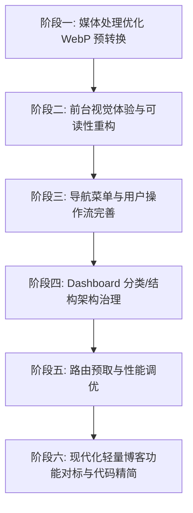

# 下一阶段开发计划（Stage 4 规划：全站视觉与动效升级、性能调优与架构治理）

> 依据 `documents/thoughts.md` 中的核心想法与待办事项，结合当前 Stage 3（动态主题配置、模块化首页、现代化 About、普通用户个人中心 User Portal）完成后的系统现状制定。  
> 制定日期：2026-09-08

---

## 📊 一、 背景与前置基础分析

### 1. 当前已完成基础（Stage 3 交付成果）
- **数据与配置层**：基于 Drizzle ORM 构建了 `siteProfile` 动态主题配置（`themeConfig`）、首页模块化开关（`landingPageConfig`，支持置顶、TOP5、Slogans 开关与选择）、About 页配置。
- **页面与模块**：
  - **Landing Page**：支持模块化条件渲染与 Top 5 热门文章 3D 卡片翻页/滑动动效（`TopHottestSection`）。
  - **About 页面**：完成了现代化品牌重构，支持工作经历时间线、多分类技能栈矩阵、精选项目与社交卡片。
  - **用户中心 (User Portal)**：普通用户与管理员分流，普通用户可在 `/user` 专属面板管理个人资料、更换头像（Dicebear / Gravatar）、修改密码、查看历史评论并接收互动回复通知。
- **管理后台 (Dashboard)**：实现了全局站点与主题可视化配置（`/dashboard/settings`）、文章状态流转管理（`/dashboard/posts`）、手动与文件上传同步中心（`/dashboard/sync`）、用户管理与密码重置（`/dashboard/users`）。

### 2. 本阶段核心演进目标（Stage 4）
根据 `thoughts.md` 的核心诉求，Stage 4 聚焦于**前台视觉沉浸感与可读性优化**、**后台/导航架构与用户操作流治理**、**媒体处理与同步性能提升（WebP 预转换）** 以及 **全站路由切换性能调优与业界对标**。

---

## 🗺️ 二、 Stage 4 核心任务拆解

---

### ⚡ 阶段一：媒体处理与上传优化（WebP 预转换加速）
**背景与目标**：目前图片在上传至 Cloudinary 之前未经压缩或格式转换，大尺寸 PNG/JPG 占用大量上传带宽且延长同步时间。在上传前统一在 Node/Bun 内存端转为 WebP 格式，大幅提升同步吞吐量并节省 CDN 流量。

1. **集成轻量图片转换库**
   - 引入 `sharp`（或利用已有的 `sharp` 流式转换能力）。
   - 在 `src/lib/sync-service.ts` 与 `scripts/upload-to-cloudinary.ts` 中封装 `optimizeImageToWebp(buffer)` 工具函数。
2. **转换策略与参数调优**
   - 自动检测 MIME 类型（`.jpg`, `.jpeg`, `.png`, `.bmp`, `.tiff`），统一转为高质量压缩的 `.webp`（如 `quality: 80, effort: 4`）。
   - 保留 GIF / SVG 的原始特性不作破坏性转换。
3. **文件名与 Public ID 自动映射适配**
   - 确保后缀名变更后的 Cloudinary public_id 与 Markdown 正文中的图片引用链接正确关联与替换。

---

### 🎨 阶段二：前台视觉体验与可读性重构（全屏色彩流转与 Hero 增强）
**背景与目标**：首页背景色彩变换目前局限于单组件内，且 Hero 区域文字在某些动态背景或亮色壁纸下可读性偏弱。

1. **首页全屏沉浸式背景色彩联动**
   - **全局背景层联动**：取消 `TopHottestSection` 当前卡片的高亮色彩光晕，以多种预设色彩（或从封面提取的主题色）替换当前的背景色延迟渐变效果。
   - **智能色彩提取（轻量方案）**：在文章同步或客户端利用 Fast Average Color / Canvas 采样封面主色调并缓存，驱动全屏环境光流转。
2. **Hero 区域文字可读性强化**
   - **排版与层次重塑**：重构 `Hero.tsx` 标语与口号组件。
   - **视觉增强手段**：
     - 口号与导语引入优雅的统一前景色 + 柔和文本阴影（`drop-shadow-sm` / `drop-shadow-md`）。
     - 关键词/核心标签采用精致的 Badge 风格（微透明背景 + 柔和边框 + 毛玻璃效果 `backdrop-blur`），确保在任何主题与背景流动下均清晰易读。

---

### 🧭 阶段三：导航菜单与用户登录态操作流完善
**背景与目标**：用户/管理员登录后仅展示简单的头像跳转，缺乏清晰的下拉菜单、身份识别与直观的注销入口。

1. **Header 菜单栏用户中心下拉菜单（User Menu Dropdown）**
   - 在 `HeaderNav.tsx` 中将头像按钮重构为功能齐备的 Dropdown Menu（基于 shadcn `DropdownMenu`）：
     - **头部信息**：展示用户头像、昵称、邮箱以及角色 Badge（`ADMIN` / `USER`）。
     - **管理员专属入口**：一键跳转“管理控制台（/dashboard）”、“文章管理”、“站点配置”、“同步中心”。
     - **普通用户入口**：一键跳转“个人中心（/user）”、“我的评论与通知”、“修改密码/资料”。
     - **注销退出操作**：提供显眼的“退出登录 (Sign out)”项，带二次确认或即时 Toast，注销后平滑清理 Session 并重定向。
2. **所有管理界面与用户中心全局统一注销**
   - 在 `/dashboard` 顶栏及 `/user` 侧边栏统一放置直观的注销按钮与返回前台链接。

---

### 🗂️ 阶段四：Dashboard 结构/分类优化与信息架构治理
**背景与目标**：梳理目前 Dashboard 的页面布局与导航层级，使其更符合现代后台的信息架构。

1. **Dashboard 侧边栏/顶栏信息架构重构**
   - 将现有零散的 ButtonGroup 整合为清晰的导航面板或统一 Layout 侧边栏/次级导航条：
     - 📊 **概览 (Overview)**：数据指标看板、热门文章与活跃用户。
     - 📝 **内容管理 (Content)**：文章管理（状态筛选/批量操作/标签联动）。
     - 🔄 **数据同步 (Sync Hub)**：文件上传、Git 仓库拉取、日志追踪。
     - ⚙️ **站点配置 (Settings)**：动态主题换肤、首页模块编排、About 经历编辑。
     - 👥 **用户管理 (Users)**：用户列表、角色变更、封禁与密码重置。
2. **移动端卡片式自适应**
   - 对宽表格在窄屏设备下自动降级为卡片流（Card List），提升触控体验。

---

### 🚀 阶段五：部署环境页面切换延迟优化（预读取与数据复用）
**背景与目标**：线上部署后，路由跳转可能存在感知延迟，需对数据预取、缓存与过渡动画进行系统性调优。

1. **Next.js 路由 Prefetch 优化**
   - 检查全站 `Link` 组件的 `prefetch` 策略，关键路由（如 `/posts`、`/about`）开启静态预取。
2. **TanStack Query / SWR 客户端缓存与水合优化**
   - 在 `useNavigationPreload` 中优化文章详情数据预热机制，利用 `staleTime` 避免无意义的重复网络请求。
   - 优化 `AdvancedPageTransition` 动效时长，将页面进出场动画控制在 150ms~250ms 以内，消除阻塞感。
3. **ISR / 静态路由构建策略微调**
   - 针对高频访问的静态文章页优化 `generateStaticParams` 与 `revalidate` 时间窗口。

---

### 🔍 阶段六：对标现代轻量博客功能、缺陷修复与代码精简
**背景与目标**：参考 Ghost、Astro Paper、Velite、Nuxt Content 等优秀博客系统，查漏补缺并精简冗余代码。

1. **核心功能查漏补缺**
   - **阅读进度指示器 (Reading Progress Bar)**：在文章详情页顶部提供平滑的滚动进度条。
   - **代码块增强**：代码高亮一键复制按钮（Copy to Clipboard）、语言标签，确认使用等宽字体显示代码。
   - **文章目录导航 (TOC - Table of Contents)**：为长文生成浮动或侧边大纲目录，支持高亮当前阅读章节。
   - **阅读时长估算 (Reading Time)**：自动基于字数计算并在卡片与详情页展示。
2. **代码结构治理与精简**
   - 清理 Stage 1/2/3 演进过程中遗留的废弃文件、无用类型声明及未引用的辅助函数。
   - 统一 Server Actions 返回结构与客户端错误 Toast 处理。

---

## 📅 三、 实施排期与分步交付计划

| 阶段 | 核心任务 | 重点文件 / 模块 | 预计交付物 |
| :--- | :--- | :--- | :--- |
| **Step 1** | WebP 图片预转换与同步吞吐优化 | `src/lib/sync-service.ts`, `scripts/` | 本地与上传图片自动转 WebP，同步耗时显著下降 |
| **Step 2** | 首页全屏色彩联动与 Hero 文字可读性重塑 | `src/components/Hero.tsx`, `TopHottestSection.tsx`, `page.tsx` | 沉浸式动态背景、Badge+阴影增强的 Hero 标语 |
| **Step 3** | 用户下拉菜单与全站注销流完善 | `src/components/HeaderNav.tsx`, `src/app/dashboard/*`, `src/app/user/*` | 统一用户下拉卡片、权限分流入口与一键注销 |
| **Step 4** | Dashboard 导航与分类信息架构重构 | `src/app/dashboard/*`, `src/components/dashboard/*` | 结构清晰的后台侧边栏/二级导航、移动端卡片流 |
| **Step 5** | 页面切换性能调优与预取优化 | `src/lib/hooks/*`, `AdvancedPageTransition.tsx`, `next.config.ts` | 毫秒级页面跳转响应、流畅的进出场动效 |
| **Step 6** | 博客功能对标（TOC/阅读时间/代码复制）与代码精简 | `src/components/PostClient.tsx`, `src/lib/utils.ts` | TOC 目录、代码一键复制、字数统计与冗余清理 |

---

## 🧪 四、 验收与质量保障标准

1. **代码规范与质量**：严格通过 `bun run lint` (Biome 0 警告 0 报错) 与 `bun run build` 静态/动态类型检查。
2. **响应式与无障碍**：所有新增与重构组件（User Menu、Dashboard 导航、TOC 等）在移动端、平板、桌面端均有良好适配。
3. **性能指标 (Lighthouse / Web Vitals)**：FCP (First Contentful Paint) < 1.0s, LCP (Largest Contentful Paint) < 1.8s, CLS < 0.05。
