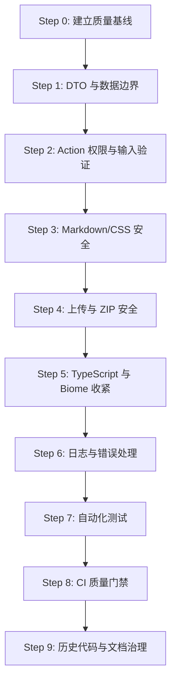

# Stage 5.2 开发计划：代码质量、安全边界与工程可靠性提升

> 制定日期：2026-09-10
>
> 前置阶段：Stage 5、Stage 5.1
>
> 后续阶段：Stage 6 独立 Gallery 内容体系

---

## 一、阶段定位

Stage 5.2 不新增主要业务功能，重点对现有代码进行一次系统性的质量、安全和工程可靠性治理。

在进入 Stage 6 Gallery 开发前，本阶段需要建立稳定、可验证、可持续维护的代码质量基线，避免将现有的输入验证、类型边界、错误处理和安全隐患继续带入新的内容体系。

本阶段核心目标是：

> **统一数据和权限边界，收紧类型与 lint 规则，治理 Markdown/上传安全，建立自动化测试和 CI 质量门禁，并确保项目文档与实际代码保持一致。**

本阶段不包含：

1. Gallery 数据模型和 Gallery 页面实现；
2. 大范围 UI 视觉重构；
3. 新增邮件、监控或其他外部服务；
4. 与代码质量无关的产品功能扩展；
5. 覆盖当前工作区已有的未提交修改。

---

## 二、当前审计结论

### 2.1 当前项目基础

- Next.js 16 App Router；
- React 19；
- TypeScript strict 模式；
- Drizzle ORM + PostgreSQL/Neon；
- Better Auth；
- Biome；
- Markdown 内容同步、Cloudinary 媒体处理和 Dashboard 管理能力已经存在；
- Stage 5 和 Stage 5.1 的主要业务目标已经完成。

### 2.2 当前主要问题

1. 评论查询仍然读取公开展示不需要的 `email` 字段，内部 User 类型与公开 DTO 仍需进一步隔离；
2. Markdown 经过 `marked` 后直接使用 `dangerouslySetInnerHTML`，缺少明确的 HTML 净化策略；
3. 动态主题 CSS 使用 `dangerouslySetInnerHTML`，需要确认其输入是否严格限制为结构化主题配置；
4. ZIP/Markdown/图片导入需要补充大小、数量、路径、格式和解压安全限制；
5. 部分 Server Actions 的输入验证不统一，仍有直接接受普通对象或字符串的入口；
6. Biome 关闭了 `noExplicitAny` 及多项可访问性规则，质量门禁偏宽松；
7. 业务代码中仍存在 `Record<string, any>`、`Map<number, any>` 等类型逃逸；
8. 错误处理和日志输出未统一，部分内部错误信息可能直接传递给客户端；
9. 项目暂未建立正式的单元测试、集成测试和 E2E 测试脚本；
10. 暂未建立独立的 CI 代码质量门禁；
11. `references/` 中保留了大量旧 Prisma、Payload 和历史 API 内容，容易造成搜索和维护噪音；
12. 部分阶段总结中的“已完成”描述与当前源码实现仍需要逐项核对。

### 2.3 当前工作区注意事项

审计时发现以下文件存在未提交修改：

```text
src/components/PostTagFilter.tsx
```

Stage 5.2 实施期间必须保留该修改，不得通过重置、覆盖或批量格式化将其意外丢失。

---

## 三、阶段目标与优先级

### P0：安全与数据边界

1. 公开 DTO 不暴露不必要的敏感字段；
2. Markdown HTML 和动态主题 CSS 具备明确的安全边界；
3. 文件上传和 ZIP 导入具备资源限制和路径保护；
4. 所有 Server Actions 具备权限校验和输入验证；
5. 错误响应不泄露内部实现细节。

### P1：类型与工程质量

1. 消除业务代码中的无理由 `any`；
2. 收紧 Biome 规则和 lint ignore；
3. 建立统一日志和错误类型；
4. 建立纯函数、Server Action 和关键页面的自动化测试；
5. 建立 CI 质量门禁。

### P2：维护性与文档治理

1. 清理或明确隔离历史代码；
2. 统一源码、README、AGENTS 和阶段总结中的架构描述；
3. 建立后续阶段可复用的质量检查清单。

---

## 四、实施路径

## Step 0：建立质量基线

### 目标

在修改源码前记录当前项目的实际质量状态，避免将历史问题和本阶段新增问题混在一起。

### 任务

1. 保留当前工作区未提交修改；
2. 执行完整静态检查、类型检查、内容检查和生产构建；
3. 统计以下指标：
   - Biome 错误数量；
   - TypeScript 错误数量；
   - 业务源码中的 `any` 数量；
   - `biome-ignore` 和其他 lint 禁用数量；
   - 直接 `console` 调用数量；
   - `dangerouslySetInnerHTML` 使用数量；
   - Server Actions 数量；
   - 缺少显式输入校验的 Action 数量；
4. 将结果记录在 Stage 5.2 实施记录或交付总结中。

### 验证命令

```bash
bun run lint
bunx tsc --noEmit --pretty false
bun run content:check -- --no-examples
bun run build
git diff --check
```

---

## Step 1：统一公开 DTO 与数据访问边界

### 目标

禁止将数据库查询结果或内部用户对象直接作为公开页面数据返回。

### 重点文件

```text
src/types/
src/lib/public-user.ts
src/lib/actions/comments.ts
src/lib/content-queries.ts
src/lib/content-providers.ts
```

### 任务

1. 将内部用户、公开评论作者、管理员用户和用户个人资料拆分为不同类型；
2. 修改评论查询，避免选择公开场景不需要的完整邮箱；
3. 保证评论公开响应只包含：
   - `id`；
   - `displayName`；
   - `image`；
   - `banned`；
4. 建立 Post、Comment、Tag、SyncLog 的稳定 DTO；
5. 对 JSONB 元数据定义明确的 TypeScript 类型和类型守卫；
6. 禁止直接将 Drizzle 查询结果扩散到客户端组件；
7. 增加公开 DTO 的单元测试和敏感字段回归测试。

### 验收标准

- 评论网络响应中不包含完整邮箱；
- 类型系统可以阻止将内部 User 赋值给公开用户类型；
- 公开 DTO 有独立的类型定义；
- 查询层只选择当前业务确实需要的字段。

---

## Step 2：统一 Server Action 权限与输入验证

### 目标

建立统一的认证、授权、输入校验和错误返回规范。

### 重点文件

```text
src/lib/actions/*.ts
src/lib/auth.ts
src/types/
```

### 任务

1. 建立并复用统一的：
   - `requireSession()`；
   - `requireUserSession()`；
   - `requireAdminSession()`；
2. 为所有 Server Actions 定义 Zod 输入 Schema；
3. 对以下输入进行长度、格式和枚举限制：
   - 用户 ID；
   - 文章 ID；
   - 评论内容；
   - 父评论 ID；
   - 路径；
   - URL；
   - 状态；
   - 搜索关键词；
   - 分页参数；
   - 上传文件；
4. 不信任客户端传入的 `role`、权限标记、资源路径和状态变更结果；
5. 对评论内容限制最大长度、控制字符和异常空白；
6. 校验父评论确实属于当前文章；
7. 限制评论回复深度和必要的频率；
8. 统一认证失败、权限失败、参数错误、资源不存在、冲突和服务器错误的处理方式。

### 示例 Schema

```ts
const createCommentSchema = z.object({
  content: z.string().trim().min(1).max(5000),
  docId: z.string().min(1).max(128),
  parentId: z.string().min(1).max(128).optional(),
  path: z.string().regex(/^\/[^\s]*$/),
})
```

### 验收标准

- 未登录请求不能执行需要用户权限的 Action；
- USER 不能执行 ADMIN Action；
- 非法输入不会进入数据库；
- 客户端不会收到数据库堆栈或内部实现错误；
- 关键 Action 均有权限和输入验证测试。

---

## Step 3：Markdown 与动态 CSS 安全治理

### 目标

在保留 Markdown 功能的同时，明确 HTML 和 CSS 的可执行边界。

### 重点文件

```text
src/components/PostClient.tsx
src/lib/theme.ts
src/app/layout.tsx
src/lib/post-metadata.ts
```

### 任务

1. 为 Markdown 转换后的 HTML 增加统一净化策略；
2. 建立允许的 HTML 标签和属性白名单；
3. 禁止以下内容：
   - `script`；
   - `iframe`；
   - `object`；
   - `embed`；
   - `form`；
   - 事件属性，如 `onclick`；
   - `javascript:` 等危险 URL 协议；
4. 对外链统一设置安全跳转属性；
5. 确认动态主题只接受结构化配置，而不是任意 CSS 字符串；
6. 对颜色、长度和主题字段进行严格校验；
7. 禁止动态主题注入：
   - `url(...)`；
   - `@import`；
   - `expression(...)`；
   - 任意选择器；
   - 任意脚本事件；
8. 增加 Markdown XSS 和主题配置安全回归测试。

### 测试样例

```md
<script>alert(1)</script>

<a href="javascript:alert(1)">click</a>
<iframe src="https://evil.example"></iframe>
```

以上内容均不得在前端形成可执行攻击。

### 验收标准

- Markdown 内容经过统一安全处理；
- 危险标签、属性和协议被移除或拒绝；
- 主题配置只能生成预期的 CSS；
- `dangerouslySetInnerHTML` 的每一处使用都有明确的安全来源和测试覆盖。

---

## Step 4：上传、ZIP 和媒体处理安全加固

### 目标

防止恶意文件、超大请求、ZIP Bomb 和路径穿越影响服务稳定性或文件系统。

### 重点文件

```text
src/lib/actions/posts-admin.ts
src/lib/sync-service.ts
scripts/upload-to-cloudinary.ts
```

### 任务

1. 限制单文件大小；
2. 限制单次请求总大小；
3. 限制 ZIP 解压后总大小；
4. 限制 ZIP 文件数量；
5. 限制压缩比并识别 ZIP Bomb；
6. 规范化 ZIP 内部路径，阻止路径穿越；
7. 清理非法或危险文件名；
8. 同时校验扩展名、MIME 类型和文件实际签名；
9. 对 SVG 内容进行安全检查，必要时禁止 SVG 上传；
10. 对图片尺寸和像素总量设置上限，防止解码内存耗尽；
11. 上传或同步失败时清理临时资源；
12. 不在日志中记录文件内容、密码、Token 或完整敏感路径。

### 建议的统一限制

```ts
const UPLOAD_LIMITS = {
  maxFiles: 100,
  maxFileSize: 10 * 1024 * 1024,
  maxRequestSize: 100 * 1024 * 1024,
  maxExtractedSize: 200 * 1024 * 1024,
}
```

实际数值应结合部署环境和 Cloudinary 限制最终确认，并集中定义，禁止散落在多个 Action 中。

### 验收标准

- 超大文件会在解析前被拒绝；
- ZIP 路径不能写出预期工作目录；
- ZIP Bomb 不会导致进程持续解压；
- 非图片内容不能仅通过修改扩展名绕过校验；
- 上传失败不会遗留临时文件或半成品记录。

---

## Step 5：收紧 TypeScript 与 Biome 质量门禁

### 目标

减少类型逃逸和无理由 lint 忽略，让质量检查结果真正反映业务代码质量。

### 重点文件

```text
tsconfig.json
biome.json
src/lib/actions/posts-admin.ts
src/components/ui/effects/ScrollStack.tsx
```

### 任务

1. 业务代码禁止新增 `any`；
2. 将 `Record<string, any>` 改为具体更新类型；
3. 将 `Map<number, any>` 改为明确的 transform 类型；
4. 对动态 JSON 使用 `unknown` 和类型守卫；
5. 移除无理由的 `as any`；
6. 逐步恢复 `noExplicitAny`；
7. 缩小 `biome-ignore` 范围，禁止无理由全文件忽略；
8. 优先修复以下可访问性规则：
   - `useButtonType`；
   - `noLabelWithoutControl`；
   - `useKeyWithClickEvents`；
   - `noStaticElementInteractions`；
9. 评估并逐步启用：
   - `noUncheckedIndexedAccess`；
   - `exactOptionalPropertyTypes`；
   - `noImplicitOverride`；
   - `noFallthroughCasesInSwitch`；
10. 确认 `allowJs` 是否仍有必要，若无实际依赖则关闭。

### 验收标准

- 业务源码无新增 `any`；
- 业务源码无未说明的 `as any`；
- 每个 lint 忽略都包含具体原因；
- UI 基础组件的特殊例外不会扩散到业务代码；
- TypeScript 检查保持零错误。

---

## Step 6：统一日志与错误处理

### 目标

让生产环境错误可诊断但不泄露敏感信息，让客户端得到稳定的错误结构。

### 建议新增文件

```text
src/lib/logger.ts
src/lib/errors.ts
```

### 任务

1. 统一替换生产代码中的裸 `console.log`、`console.warn` 和 `console.error`；
2. 提供 `debug`、`info`、`warn`、`error` 日志级别；
3. 在日志中包含模块名和必要的请求上下文；
4. 自动脱敏以下内容：
   - 密码；
   - 邮箱；
   - Session；
   - Token；
   - API Key；
   - 数据库连接字符串；
5. 定义统一的错误码：
   - `UNAUTHORIZED`；
   - `FORBIDDEN`；
   - `VALIDATION_ERROR`；
   - `NOT_FOUND`；
   - `CONFLICT`；
   - `INTERNAL_ERROR`；
6. 服务端记录详细异常，客户端只接收用户可理解的安全消息；
7. 同步系统保留可供管理员排错的必要信息，但不得输出凭据和完整内部堆栈。

### 验收标准

- 生产业务代码无裸日志调用；
- 错误响应不包含数据库、文件系统和第三方服务的内部细节；
- 管理后台仍能看到足够的同步失败原因；
- 错误返回结构可以被前端统一处理。

---

## Step 7：建立自动化测试体系

### 目标

优先覆盖容易回归且与安全、数据一致性直接相关的纯函数和服务端逻辑。

### 测试层级

#### 第一层：纯函数单元测试

建议覆盖：

- slug 生成和冲突保护；
- Frontmatter 解析和校验；
- Post metadata；
- Markdown 导出；
- 内容差异计算；
- Public User DTO；
- 头像 seed；
- URL 校验；
- 主题配置校验；
- 文件名和 ZIP 路径安全处理；
- Markdown HTML 净化。

建议测试目录：

```text
src/lib/__tests__/
```

#### 第二层：Server Action 集成测试

重点覆盖：

- 未登录访问；
- 普通用户访问管理员 Action；
- 管理员正常操作；
- 非法参数；
- 文章不存在；
- 父评论不属于当前文章；
- 上传超限；
- 同步冲突；
- 数据库错误。

#### 第三层：关键页面 E2E 测试

优先覆盖：

- 登录；
- 评论创建和回复；
- Dashboard 权限；
- 文章导入；
- 头像切换；
- 标签筛选；
- 文章公开访问。

### 测试要求

1. 先确认现有项目允许的测试工具和运行环境；
2. 不引入与项目技术栈不匹配的重型测试基础设施；
3. 失败场景优先于普通成功场景；
4. 安全相关工具测试覆盖率目标不低于 90%；
5. 关键纯函数测试覆盖率目标不低于 80%。

---

## Step 8：建立 CI 质量门禁

### 目标

让质量检查在 Pull Request 和主分支变更时自动执行，避免仅依赖人工记忆。

### 建议新增文件

```text
.github/workflows/quality.yml
```

### 建议执行步骤

```bash
bun install --frozen-lockfile
bun run lint
bunx tsc --noEmit --pretty false
bun run content:check -- --no-examples
bun run test
bun run build
```

### 建议任务拆分

```text
quality-static
  - Biome
  - TypeScript
  - content check

quality-test
  - unit tests
  - integration tests

quality-build
  - Next.js production build
```

### 验收标准

- Pull Request 不能绕过静态检查；
- lint、类型检查、测试或构建失败时不能合并；
- CI 使用锁文件安装依赖；
- CI 不输出环境变量和敏感配置；
- 内容检查和构建在无生产数据库写入的情况下运行。

---

## Step 9：历史代码与文档治理

### 目标

降低历史实现对搜索、审计和后续开发的干扰，确保项目文档和源码一致。

### 任务

1. 评估 `references/` 是否继续保留；
2. 如果保留，增加明确说明：
   - 仅供历史参考；
   - 不参与构建和运行；
   - 不得直接复制到生产代码；
3. 评估是否将其迁移为更明确的 `archive/` 目录；
4. 清理与当前 Drizzle、Better Auth 和统一 Post 架构冲突的旧文档；
5. 更新 `AGENTS.md` 中已经过时的 Prisma/Stage 2 状态描述；
6. 更新 README 当前阶段与后续阶段说明；
7. 修正阶段总结中“前端不渲染”和“服务端不返回”的概念混淆；
8. 每个阶段总结中的“已完成”项目必须对应实际文件和验证命令；
9. 将已知边界记录为后续任务，避免只停留在文档描述中。

### 验收标准

- 全局搜索默认不会将历史代码误判为生产代码；
- README、AGENTS、阶段计划和阶段总结对当前架构描述一致；
- 文档中的验证命令可以在当前项目执行；
- 不再保留明显误导后续开发的旧架构说明。

---

## 五、建议新增或统一的工程规范

### 5.1 Server Action 规范

所有 Server Actions 应遵循以下顺序：

```text
1. 解析和校验输入
2. 校验 Session
3. 校验 Role 和资源权限
4. 执行业务逻辑
5. 处理事务或外部资源
6. 记录安全日志
7. 返回稳定 DTO 或统一错误结构
8. 必要时执行 revalidatePath
```

### 5.2 数据返回规范

禁止：

- 直接返回 Drizzle 查询结果；
- 直接返回完整 User、Account、Session；
- 将数据库 JSONB 原样暴露给公开页面；
- 将内部异常对象传给客户端。

必须：

- 通过 DTO 映射；
- 显式选择字段；
- 对公开数据和管理数据分离；
- 对 JSONB 进行验证和收窄。

### 5.3 日志规范

禁止记录：

- 密码；
- 完整邮箱；
- Session Token；
- API Key；
- 数据库 URL；
- 上传文件完整内容；
- 未脱敏的内部路径。

### 5.4 忽略规则规范

每个 lint 或类型忽略必须说明：

1. 为什么无法直接修复；
2. 忽略的影响范围；
3. 后续是否有移除计划。

禁止使用无理由的全文件忽略。

---

## 六、最终验收标准

### 6.1 必须通过的命令

```bash
bun run lint
bunx tsc --noEmit --pretty false
bun run content:check -- --no-examples
bun run test
bun run build
git diff --check
```

如果项目在实施前尚未建立 `test` 脚本，则必须在本阶段补充测试脚本，或在阶段总结中明确记录暂时无法执行的原因和替代验证方式。

### 6.2 必须满足的质量要求

- TypeScript 错误数量为 0；
- Biome 错误数量为 0；
- 生产构建成功；
- 评论公开响应不包含完整邮箱；
- 所有需要保护的 Server Actions 都有 Session 和 Role 校验；
- 所有外部输入都有 Zod 或等价的运行时验证；
- Markdown HTML 经过安全处理；
- 动态主题不能注入任意 CSS；
- 上传和 ZIP 导入具备大小、数量、路径和格式限制；
- 业务代码不新增 `any`；
- 错误响应不泄露内部实现信息；
- 关键纯函数具备自动化测试；
- CI 能够自动阻止质量不合格的 Pull Request；
- Stage 文档与实际源码和验证结果一致；
- 当前已有的未提交修改未被覆盖。

### 6.3 建议指标

| 指标 | 目标 |
| :--- | ---: |
| TypeScript 错误 | 0 |
| Biome 错误 | 0 |
| 构建错误 | 0 |
| 业务代码新增 `any` | 0 |
| 公开 DTO 敏感字段 | 0 |
| 未校验的 Server Action 输入 | 0 |
| 未净化的 Markdown HTML | 0 |
| 无理由的 lint ignore | 0 |
| 关键纯函数测试覆盖率 | ≥ 80% |
| 安全相关测试覆盖率 | ≥ 90% |

---

## 七、实施顺序建议



实施原则：

1. 先记录基线，再修改规则；
2. 先修复安全和数据边界，再做大范围类型收紧；
3. 先覆盖纯函数和高风险服务端逻辑，再扩展 E2E；
4. 每一步都单独执行 lint、类型检查和相关测试；
5. 避免与 Stage 6 的 Gallery 功能交叉修改；
6. 每次提交保持单一主题，便于回滚和审查。

---

## 八、阶段交付物

Stage 5.2 完成时应包含：

1. 本计划对应的源码变更；
2. 统一的 DTO、权限、输入验证和错误处理实现；
3. Markdown、动态主题和上传安全加固；
4. TypeScript 和 Biome 规则收紧记录；
5. 自动化测试与测试报告；
6. CI 质量 Workflow；
7. 历史代码和文档治理结果；
8. `documents/stage5.2-summary.md` 交付总结；
9. 最终 lint、类型检查、测试、内容检查和构建结果。
