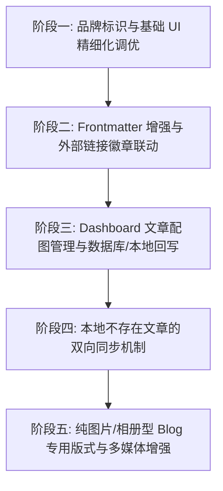

# 第五阶段开发计划（Stage 5 规划：UI 视觉微调、Frontmatter 增强与双向内容同步）

> 依据 `documents/stage4-summary.md` 中的交付状态，结合 `documents/thoughts.md` 中的核心诉求与未来功能规划制定。  
> 制定日期：2026-09-08

---

## 📊 一、 背景与前置基础分析

### 1. 当前已完成基础（Stage 4 交付成果）
- **性能与媒体**：完成 WebP 内存流式预转换，大幅度降低 CDN 消耗与上传耗时；全站开启 Next.js 路由预取与 TanStack Query 缓存优化，页面过渡平滑响应。
- **前台阅读与对标体验**：
  - 文章详情页落地全自动多级大纲目录（Sticky TOC + 移动端折叠目录），具备精准高亮指示与平滑滚动。
  - 顶部滚动阅读进度条（Reading Progress Bar）。
  - 中英文智能阅读时长估算与字数统计（Reading Time & Words Count）。
  - Markdown 代码块一键复制与语言标识 Badge。
- **后台与权限**：Dashboard 完成清晰的二级导航架构治理，表格数据在移动端全面支持卡片流自适应；全站统一用户下拉菜单与注销退出流。

### 2. 本阶段核心演进目标（Stage 5）
根据 `documents/thoughts.md` 的待办事项与产品愿景，Stage 5 将从 **UI 精细化视觉质感**、**Frontmatter 元数据能力深度挖掘（外链与富媒体展示）**、**Dashboard 文章配图回写与双向同步**、**纯图片瀑布流/相册版式适配** 4 个核心维度进行系统性开发。

---

## 🗺️ 二、 Stage 5 核心任务拆解



---

### 🎨 阶段一：品牌标识应用与基础 UI/配色精细化调优

**背景与目标**：应用已有的 `zick.logo.svg`，`zick.logo.png` 品牌 Logo，调整阅读进度条的高度与精致感，重构文章分类标签/过滤器的视觉形式与配色，优化全局基础 UI 调色板，提升整体精致度。

1. **应用网站品牌 Logo**
   - **Header 顶栏**：在 `HeaderNav.tsx` 替换纯文本 `zick.me`，嵌入带矢量动画/高分屏自适应的 `zick.logo.svg`，保留优雅的 Hover 与品牌文字联动。
   - **Footer 与品牌区域**：在页脚、关于页及后台登录/个人中心等位置统一样式规范。
   - **Favicon 与元数据**：确保浏览器 Tab 图标与 App 图标一致性。并适配移动设备图标。

2. **精简与优雅化阅读进度条**
   - **缩减高度**：将文章详情页（`PostClient.tsx`）顶部进度条高度从 `h-1`（4px）微调缩减至更为轻盈沉浸的`h-[2px]`，可尝试将进度条浮于导航条上方或下方（导航条半透明）。
   - **视觉质感**：增加微妙的渐变微光与轻阴影，避免对阅读视线造成侵入感。

3. **文章过滤器表现形式与配色升级**
   - **PostGridClient 过滤器重构**：将现有的普通按钮组升级为更具现代感的毛玻璃滑动切换器。
   - **标签配色与对比度治理**：优化标签自带色彩与 Dark/Light 主题背景的融合度，使用精细的半透明背景配合同色系边框与圆角 Badge，提供更柔和的视觉反馈。
   - **基础 UI 配色调优**：调整主题基色中 primary/secondary/accent 的对比度与微暗色调，使整体视觉更加统一现代。

---

### 🔗 阶段二：Frontmatter 深度扩展与外部链接/元数据展示

**背景与目标**：充分发掘 Markdown Frontmatter 的通用潜力，支持在文章头部以标准化、结构化的方式呈现外部关联（如 GitHub 仓库、在线 Demo、文档源、Figma 等），丰富博客表达力。

1. **Frontmatter 元数据规范扩充**
   - 在 `sync-service.ts`、`check-content.ts` 及 Drizzle Post Schema 中支持扩展字段（如 `links`、`github`、`demo`、`sourceUrl`、`category` 等或通用 `metadata` JSONB 字段）。
2. **文章详情页与卡片的外链图标展示**
   - **位置与排版**：在文章标题（Title）与文章封面图（Poster）下方、正文上方，优雅渲染外链栏。
   - **智能图标与 Badge**：针对 GitHub、Twitter/X、Figma、Live Demo、Paper/PDF 等自动匹配对应的 SVG 品牌图标，呈现直观的外链胶囊按钮，支持一键安全外链跳转（`target="_blank" rel="noopener noreferrer"`）。
3. **扩展适用 Blog 的 Frontmatter 功能**
   - 支持 `series`（文章合集/系列）、`canonicalUrl`（原文链接）、`outdatedWarning`（过时提醒阈值）等通用配置，丰富博客元信息生态。

---

### 🖼️ 阶段三：Dashboard 文章配图管理与数据库/本地 Markdown 回写

**背景与目标**：在后台文章管理列表或详情中，支持管理员直接替换、调整文章封面图或插图；调整后的图片自动更新到数据库，并在下一次本地同步或触发回写时自动更新本地 `content/posts/` 对应 Markdown 的 Frontmatter。

1. **Dashboard 文章配图编辑与上传**
   - 在 `/dashboard/posts` 的文章操作面板中增加“调整封面配图”对话框。
   - 支持本地图片即时上传（直接走 Cloudinary WebP 压缩上传流水线）或输入外部图片 URL。
   - 提供封面图预览、裁剪比例建议（16:9）与一键移除/替换。
2. **数据库落库与版本标记**
   - 编写 Server Action `updatePostPosterAction`，实时更新 PostgreSQL 中的 `poster` 字段与更新时间戳。
3. **本地 Markdown 文件回写机制 (Write-back Engine)**
   - 在本地运行 `sync-content.ts` 或后台触发时，若数据库的修改时间/图片配置新于本地 Frontmatter，将新的图片链接回写更新至对应 `.md` 文件的 Frontmatter `poster` / `image` 字段，保持本地与数据库一致性。

---

### 🔄 阶段四：双向内容同步机制（本地缺失文章拉取与双向一致）

**背景与目标**：当在 Dashboard 网页端直接新建/上传了文章，或多设备协作导致本地 `content/posts/` 缺失部分数据库文章时，支持将数据库中存在的文章反向导出并同步到本地。

1. **双向差异比对算法 (Bi-directional Diff)**
   - 比较本地文件列表与数据库 `posts` 记录（基于 `slug`、`updatedAt`、文件指纹）。
   - 识别出 3 种状态：本地新增待推送、数据库新增待拉取、两端冲突待合并。
2. **数据库文章导出为标准 Markdown**
   - 编写 `PostToMarkdownExporter` 工具，将数据库中的 Title、Slug、Tags、Poster、Links、Content 组装为标准 YAML Frontmatter 的 `.md` 文件。
3. **拉取与双向同步命令**
   - 增加终端脚本 `bun run sync:pull` 或在 `sync-service.ts` 中增加 `--bidirectional` 模式。
   - 在 Dashboard `/dashboard/sync` 提供“导出/备份数据库文章至本地/ZIP 下载”功能。

---

### 📸 阶段五：纯图片/摄影相册型 Blog 专用版式适配（已拆分至 Stage 6）

**架构决策**：该部分不再作为 Stage 5 的 Post `layout` 分支实施。摄影相册、设计稿集合和纯图片作品集拥有独立的内容源、媒体同步、数据模型和前台交互，因此整体拆分为独立的 Stage 6。

详细计划见：[`documents/development-plan-stage6.md`](development-plan-stage6.md)。
1. 新增独立内容目录 `content/photo-gallery/` 与 `album.yaml` 规范；
2. 新增 `Gallery` / `GalleryImage` 数据模型；
3. 新增 `GallerySyncService` 与独立 Cloudinary folder；
4. 新增 `/gallery` 与 `/gallery/[albumSlug]` 路由；
5. 实现 Masonry、Lightbox、EXIF 和 Gallery Dashboard 管理。

---

## 📅 三、 阶段演进规划与步骤拆解

| 阶段步骤 | 核心任务 | 涉及主要模块 / 文件 | 预期成果 |
| :--- | :--- | :--- | :--- |
| **Step 1** | **品牌 Logo 应用与基础 UI/过滤器配色升级** | `HeaderNav.tsx`, `PostGridClient.tsx`, `PostClient.tsx`, `public/zick.logo.svg` | 正式应用品牌 SVG Logo；缩减进度条高度；胶囊式过滤器与精致 UI 调色 |
| **Step 2** | **Frontmatter 扩展与外链/图标富媒体展示** | `src/lib/sync-service.ts`, `PostClient.tsx`, `PostCard.tsx`, `check-content.ts` | 标题/标题图下方渲染 GitHub/Demo 等外链图标胶囊；支持扩展元数据 |
| **Step 3** | **Dashboard 配图修改与本地回写机制** | `src/app/dashboard/posts/*`, `src/lib/actions/posts-admin.ts`, `sync-service.ts` | 在线调整/上传文章配图；数据入库并回写至本地 Markdown 文件 |
| **Step 4** | **双向内容同步与数据库文章拉取** | `scripts/sync-content.ts`, `src/lib/sync-service.ts`, `src/app/dashboard/sync/*` | 支持本地与数据库双向同步（`bun run sync:pull`），可将线上文章导出至本地 |
| **Stage 6** | **独立图片相册与 Gallery 内容体系** | `documents/development-plan-stage6.md` | 独立 `Gallery/GalleryImage` 模型、Cloudinary folder、`/gallery` 路由与画廊体验 |

---

## 🧪 四、 验收与质量验证标准

1. **视觉与交互验收**：
   - 导航栏中 `zick.logo.svg` 清晰展示，在深浅色模式及各种缩放下不失真。
   - 阅读进度条高度控制在 2~2.5px，滑动流畅不卡顿。
   - 文章外链（如 GitHub）在标题与封面下方展示对应 SVG 图标并能正确跳转。
   - 标签过滤器与卡片配色在浅色与深色模式下对比度均符合 Web 无障碍标准。
2. **数据与同步验收**：
   - Dashboard 调整配图后，页面即时生效，再次运行本地同步脚本能正确更新本地 `.md` 文件的 Frontmatter。
   - 双向同步能准确识别远端新文章并自动保存到 `content/posts/` 且不破坏已有格式。
3. **代码规范与生产构建**：
   ```bash
   bun run lint    # 0 errors, 0 warnings
   bun run build   # Next.js Turbopack 顺利构建
   ```
