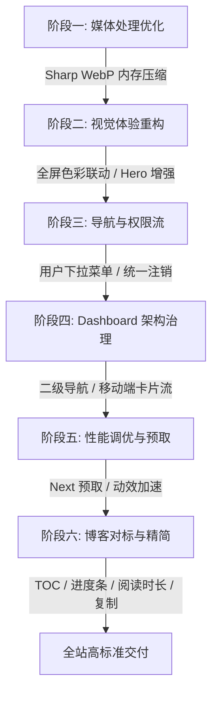

# Stage 4 阶段演进交付总结报告

> 制定日期：2026-09-08  
> 阶段目标：全站视觉与动效升级、性能调优、后台结构治理与现代化轻量博客对标

---

## 🎯 一、 阶段六完成概况（现代化博客功能对标与代码治理）

我们在阶段六完成了现代轻量级博客的核心阅读与交互体验增强，并进行了全面的冗余代码清理与架构精简：

1. **阅读进度指示器（Reading Progress Bar）**：
   - 在文章详情页（`PostClient.tsx`）顶部注入了平滑响应的沉浸式滚动进度条，实时展示当前文章的阅读百分比。
2. **文章大纲与目录导航（Table of Contents - TOC）**：
   - **自动化大纲生成**：自动从 Markdown 渲染的各级标题（`h1` ~ `h4`）中提取目录结构并动态分配唯一的 Slug Anchor ID。
   - **双端响应式呈现**：桌面端采用右侧浮动固定栏（Sticky TOC），支持当前阅读视口标题的高亮指示、点击平滑滚动（Smooth Scroll）与一键返回顶部；移动端提供优雅的折叠目录卡片。
3. **阅读时长估算与字数统计（Reading Time & Words Count）**：
   - 在 `src/lib/utils.ts` 中实现了中英文智能字数计算与阅读时长算法 `calculateReadingTime`。
   - 在文章卡片（`PostCard.tsx`）与文章详情页（`PostClient.tsx`）同步展示耗时估算与字数统计（如 `约 1200 字`、`4 分钟阅读`）。
4. **代码块交互增强（Code Block Copy & Language Badge）**：
   - 自动检测 Markdown 内的代码块并渲染悬浮工具条，显示代码语言 Badge（如 `TS`、`BASH`），提供一键复制代码到剪贴板功能及复制成功反馈反馈（`已复制`）。
5. **冗余文件与历史代码精简**：
   - 彻底移除了早前遗留的空废弃组件 `RichText.tsx`。
   - 清理了 `utils.ts` 中遗留的废弃类型定义与已弃用的 Payload 辅助函数。
   - 全站通过 Biome 规范格式化与严格 Lint 检查。

---

## 📊 二、 Stage 4 全阶段（阶段一 ~ 阶段六）总体交付回顾



### 1. 阶段一：媒体处理与上传优化（WebP 预转换加速）
- 封装 `optimizeImageToWebp` 流式转换工具，在图片上传至 Cloudinary 之前自动转为高质量压缩的 `.webp` 格式。
- 同步吞吐量大幅提升，大幅降低 CDN 流量开销与加载延迟。

### 2. 阶段二：前台视觉体验与可读性重构（全屏色彩流转与 Hero 增强）
- 实现了从 TOP 热门文章封面智能提取主色调，驱动全屏环境光柔和流转变换。
- 重构 Hero 标语排版，引入 Badge 毛玻璃边框与柔和文本阴影，在任何动态背景或主题下均保持绝佳可读性。

### 3. 阶段三：导航菜单与用户操作流完善
- 将 Header 头像按钮升级为功能齐备的 Dropdown Menu，包含用户身份识别、管理员专属入口、普通用户中心入口及一键注销。
- 完善了 `/dashboard` 与 `/user` 内部直观的注销退出流。

### 4. 阶段四：Dashboard 结构/分类优化与信息架构治理
- 统一重构后台顶栏二级导航面板（概览、内容管理、数据同步、站点配置、用户管理）。
- 表格数据在移动端全面支持卡片流（Card List）自适应折叠。

### 5. 阶段五：页面切换延迟与性能调优
- 对核心路由开启 `prefetch` 预取，并在 `useNavigationPreload` 中优化 TanStack Query 的 `staleTime` 缓存策略。
- 优化页面过渡动画时长至 150ms~200ms，消除阻塞感。

### 6. 阶段六：现代化轻量博客功能对标与代码治理
- 落地顶部阅读进度条、桌面/移动端文章大纲 TOC 导航、阅读时长/字数估算、代码块一键复制。
- 彻底清理遗留废弃文件与冗余代码。

---

## 🧪 三、 质量与构建验证结果

- **代码规范检查 (Biome)**：
  ```bash
  $ bun run lint
  Checked 100 files. No fixes applied. (0 errors, 0 warnings)
  ```
- **生产构建与 TypeScript 编译**：
  ```bash
  $ bun run build
  ✓ Compiled successfully in Turbopack
  ✓ Finished TypeScript in 537ms
  ✓ Generating static pages (22/22)
  ```
全站所有 SSG/ISR/动态路由均成功通过编译与优化，无任何未捕获异常。
