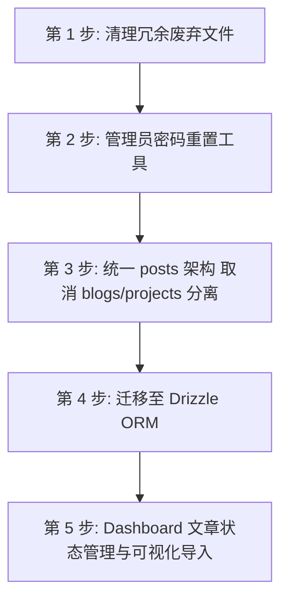

# 下一阶段开发计划（Stage 2 开发规划）

> 依据 `documents/thoughts.md` 中的需求与当前代码库架构分析制定。  
> 制定日期：2026-09-07

---

## 📊 一、 当前项目开发状况分析

### 1. 技术栈现状
- **框架与运行时**：Next.js 16 (App Router + React 19) + TypeScript + Bun/Node.js。
- **数据与ORM**：PostgreSQL (Neon) + Prisma 7 ORM (`prisma/schema.prisma` 生成至 `src/generated/prisma`)。
- **认证系统**：Better-Auth (`better-auth` + `@better-auth/prisma`)，支持基于 Role 的权限体系（ADMIN/EDITOR/USER）与用户管理。
- **内容存储与同步**：
  - 本地 Markdown/Obsidian (`content/posts/`) 通过 GitHub Actions 自动化触发脚本同步。
  - 依赖两条 Action 流程：`media.yml` (上传图片至 Cloudinary) -> `sync-db.yml` (解析 md 并 upsert 到 PostgreSQL)。
  - 目前区分 `BLOG` 与 `PROJECT` 两种类型。
- **管理后台 (Dashboard)**：已具备基础统计、用户列表查看、封禁解封、评论审核（Spam标记/删除）以及个人资料编辑功能。

### 2. 核心痛点与问题
1. **内容同步脆弱性**：高度依赖 GitHub Actions。由于 Cloudinary 图片映射规则与 Markdown 解析、事务处理紧耦合，Actions 失败或报错时排查极为困难。
2. **分类割裂与冗余**：前端与数据库中硬编码区分了 `blogs` 与 `projects`（包括路由 `/blog`、`/projects`，PostCard 路由分支，多余的 Project 字段等），结构复杂且不够通用。
3. **ORM 冗余与体积**：Prisma Client 生成代码量大，冷启动与 Serverless 环境开销较大，且计划迁移至更轻量、类型安全且易于与 Neon 结合的 **Drizzle ORM**。
4. **运维与安全隐患**：缺少便捷的管理员密码重置/找回机制，若管理员忘记凭据需手动修改数据库。
5. **Dashboard 缺乏内容掌控力**：无法在管理后台直观查看文章状态（草稿/发布/归档）、解析状态与图片上传状态，缺乏手动触发同步与上传能力。

---

## 🗺️ 三、 下一阶段开发计划与实施路径

### 阶段一：管理员与用户密码重置及运维增强（免邮件系统方案）
**目标**：避免配置和维护繁琐的邮件系统，提供简单高效的脚本与后台手动重置方案。

1. **CLI 运维脚本工具（管理员自救）**
   - 编写 `scripts/reset-admin-password.ts`，支持在终端直接指定管理员邮箱并重置密码（基于 Better-Auth 密码哈希逻辑），无需依赖邮件链路。
2. **Dashboard 用户管理与手动重置（用户密码重置流程）**
   - 不启用自动发送邮件验证码/重置链接机制。
   - **重置流程**：普通用户若忘记密码，可自行发送邮件至管理员邮箱提出重置申请；管理员核实后在 Dashboard 用户管理面板（`/dashboard/users`）直接手动重设该用户的密码或临时密码。
   - 在个人资料（`EditProfile.tsx`）中补充已登录用户自行修改密码的校验与提示。

---

### 阶段二：统一内容架构（取消 blogs / projects 分离）
**目标**：消除两套内容路由与结构的割裂，统一为 `Post` 体系，简化内容管理与前端交互。

1. **内容目录结构重组**
   - 将 `content/posts/blogs/*` 与 `content/posts/projects/*` 统一收拢到 `content/posts/` 结构下。
   - 统一 slug 生成规则（`src/lib/slug.ts`），去掉硬编码的 `blogs-` / `projects-` 前缀依赖。
2. **数据层与类型重构**
   - 调整 `prisma/schema.prisma`（或在 Drizzle 迁移时）：将 `type: PostType (BLOG/PROJECT)` 简化，或通过文章的 `tags` / `category` 来区分展现形式。
   - 废弃 `images` / `sourceUrl` 等专属于 Project 的硬编码字段，转为由 Markdown 扩展或通用元数据承载。
3. **路由与页面合并**
   - 废弃 `/projects` 与 `/projects/[slug]` 路由。
   - 保留 `/blog` 或统一重构为 `/posts`，建立向后兼容的 301 重定向机制（如从 `/projects/:slug` 重定向到 `/posts/:slug`）。
   - 更新头部导航（`HeaderNav.tsx`）、搜索（`GlobalSearch.tsx`）、首页推荐列表（`HomeScrollArea.tsx`）等组件。

---

### 阶段三：ORM 体系迁移（Prisma ➡️ Drizzle ORM）
**目标**：以轻量、高性能、与 Serverless / Edge 深度契合的 Drizzle ORM 替代 Prisma。

1. **依赖与基础设施准备**
   - 安装 `drizzle-orm`、`drizzle-kit`、`@neondatabase/serverless`（或 `pg`）。
   - 编写 `drizzle.config.ts`。
2. **Schema 定义迁移**
   - 在 `src/db/schema/` 中重写表结构：
     - `users`, `accounts`, `sessions`, `verifications` (适配 Better-Auth Drizzle 适配器)
     - `posts`, `tags`, `post_tags` (统一的帖子与多对多标签)
     - `comments` (支持树状/嵌套与审核状态)
     - `site_profile`
3. **数据查询与 Server Actions 重写**
   - 切换 Better-Auth 适配器为 `drizzleAdapter`。
   - 重构 `src/lib/content-queries.ts`、`src/lib/content-providers.ts`、`src/lib/actions/*`。
   - 迁移 `sync-content.ts` 等自动化脚本至 Drizzle 查询。
4. **清理 Prisma 依赖**
   - 移除 `prisma`、`@prisma/client`、`@prisma/adapter-pg` 及生成的 `src/generated/prisma`。

---

### 阶段四：Dashboard 文章管理与可视化导入系统
**目标**：摆脱纯 GitHub Actions 黑盒同步带来的排查困难，在 Dashboard 内实现可视化的文章导入、解析监控与状态管理。

1. **Dashboard 文章管理看板 (`/dashboard/posts`)**
   - **文章列表与筛选**：支持按发布状态（`PUBLISHED` / `DRAFT` / `ARCHIVED`）、标签、更新时间排序与筛选。
   - **文章状态切换**：支持在后台一键修改文章状态（发布、下架、转为草稿）。
   - **文章快速预览与软删除恢复**。
2. **可视化内容同步与导入中心 (`/dashboard/sync`)**
   - **一键手动触发同步**：在 Dashboard 提供“立即扫描并同步”按钮（Server Action / API 端点）。
   - **多阶段状态日志监控**：
     - 阶段 1：Markdown 解析状态（Frontmatter 校验、Slug 冲突检测）。
     - 阶段 2：图片提取与 Cloudinary 上传状态（成功/跳过/失败，直观展示失败原因）。
       - 应限制图片尺寸（以27寸4k显示器为基准），过大应进行缩图/格式转换处理
     - 阶段 3：数据库写入与标签关联状态。
   - **支持 Web 端文件直接上传/导入**：除了本地 Git 提交，允许在网页端直接上传 `.md` 压缩包或单个 Markdown 文件进行解析入库。
3. **同步排错与历史日志**
   - 记录每次同步的详细日志（包含时间、变更文章数、错误堆栈），极大简化排查成本。

---

## 📅 四、 实施优先级建议

1. **第 1 步（即刻清理）**：清理 `references/` 等废弃冗余代码，保持工作区清爽。
2. **第 2 步（紧急运维）**：实现管理员密码重置脚本与安全保障。
3. **第 3 步（结构统一）**：合并 `blogs`/`projects`，降低后续 ORM 迁移和后台开发的复杂度。
4. **第 4 步（架构升级）**：执行 Prisma 到 Drizzle 的全面迁移。
5. **第 5 步（功能完善）**：完成 Dashboard 文章管理、状态维护与可视化导入诊断系统。
